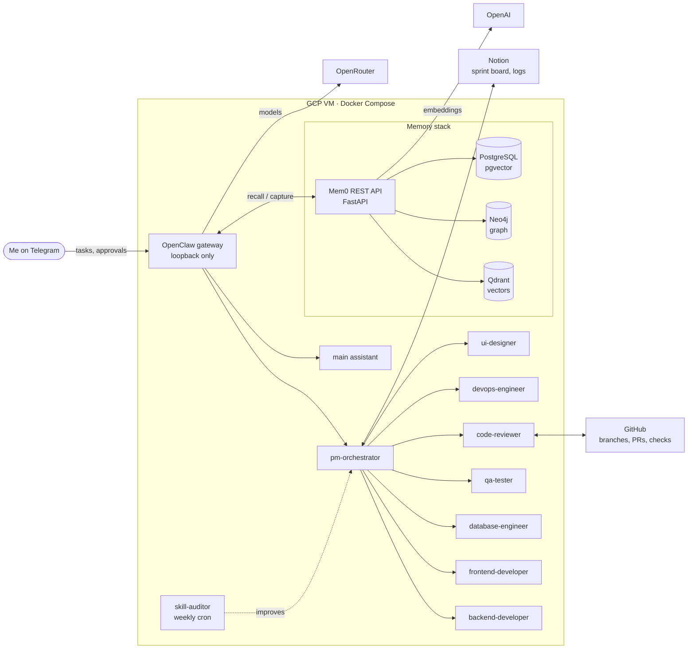

# Agent Workforce

A self-hosted, multi-agent software team built on [OpenClaw](https://github.com/openclaw/openclaw). Nine specialised agents (PM, backend, frontend, database, QA, code review, DevOps, UI design and a skill auditor) work on tasks that I send over Telegram. They share long-term memory through Mem0, track work in Notion, open pull requests on GitHub, and can't ship anything critical without my approval.

It runs on a single GCP VM with Docker Compose.

## Architecture



## How it works

**Task flow.** I message the workforce bot on Telegram. The PM orchestrator breaks the task into subtasks, assigns them to specialists, and tracks progress on a Notion sprint board with an agent log and a decision log.

**Human-in-the-loop gates** ([`gate-manager`](openclaw/skills/gate-manager/SKILL.md)). Four checkpoints need my explicit approval, and agents can't approve their own gates or each other's:

| Gate | Trigger | Approval |
| --- | --- | --- |
| 1. Task plan | PM finishes the breakdown | Telegram reply |
| 2. Pull request | Code review passes | GitHub PR review |
| 3. Deploy | PR merged, checks green | Telegram reply |
| 4. Architecture | Schema, dependency or API decision | Telegram reply |

**Long-term memory.** The `openclaw-mem0` plugin recalls relevant memories before each turn and captures new facts after it. Mem0 stores them as vectors in Qdrant and as relationships in Neo4j, so agents remember decisions and context across sessions.

**Cost-aware model routing.** Each agent gets a model sized to its job through OpenRouter: Claude Sonnet as the default for high-stakes reasoning, Claude Haiku for QA and auditing, and GLM models for high-volume implementation work. See [`openclaw.example.json`](openclaw/openclaw.example.json).

**Self-improvement.** Each agent's behaviour lives in versioned markdown files in [`agents/`](agents/): `AGENTS.md` for operating instructions, `SOUL.md` for personality, plus skills. Every Sunday the skill-auditor reads the feedback log, looks for patterns and updates agent files, writing an audit report each time.

**Scheduled work** ([`jobs.example.json`](openclaw/cron/jobs.example.json)). A daily summary from the PM (active, blocked and gated tasks) and the weekly skill audit.

## Engineering notes

Problems I ran into and how I solved them:

- **Embeddings routing.** OpenRouter doesn't offer an embeddings API, so chat models go through OpenRouter while embeddings go straight to OpenAI (`text-embedding-3-small`).
- **Version pinning.** Qdrant and Neo4j images are pinned (`qdrant:v1.13.4`, `neo4j:5.26.4`) after version issues while setting up the memory stack.
- **Locked-down networking.** The gateway binds to loopback and every service port is bound to `127.0.0.1`, so nothing is exposed publicly. Telegram uses an allowlist, and risky device commands (camera, SMS, contacts) are denied.
- **Prompt regression tests.** I iterated on PromptFoo suites for the code-review and frontend agents and worked through provider-configuration issues in PromptFoo along the way.

## Repository layout

```
agents/                  one workspace per agent: role (AGENTS.md), personality (SOUL.md), identity
memory-stack/            Mem0 REST server, Qdrant, Neo4j and Postgres (docker-compose.yml)
openclaw/
  openclaw.example.json  agents, model routing, channels, plugins (secrets replaced with ${VARS})
  agents/                per-agent model catalogue
  cron/                  scheduled jobs
  hooks/                 Mem0 recall/capture hook
  skills/                custom skills: gate-manager, github-ops, notion-board, mem0-memory
  skills/adapted/        skills adapted from agency-agents (MIT)
.env.example             every variable the stack needs
```

## Running it

```bash
cp .env.example .env              # fill in your keys
cd memory-stack
cp config.example.yaml config.yaml
docker compose --env-file ../.env up -d

npm i -g openclaw                 # then copy openclaw/ into ~/.openclaw
cp openclaw/openclaw.example.json ~/.openclaw/openclaw.json
cp -r agents ~/agent-workforce-project/agents   # workspace paths used in the config
```

## Stack

`OpenClaw` `Python` `FastAPI` `Docker Compose` `GCP` `Mem0` `Qdrant` `Neo4j` `PostgreSQL` `OpenRouter` `Telegram` `Notion API` `GitHub API` `PromptFoo`

## License

MIT, see [LICENSE](LICENSE). Third-party parts keep their own licenses, listed below.

## Credits

- `memory-stack/` is based on the [Mem0](https://github.com/mem0ai/mem0) REST API server (Apache-2.0, see [`memory-stack/LICENSE`](memory-stack/LICENSE)).
- `openclaw/skills/adapted/` starts from agent definitions in [agency-agents](https://github.com/msitarzewski/agency-agents) (MIT, see [`openclaw/skills/adapted/LICENSE`](openclaw/skills/adapted/LICENSE)).
